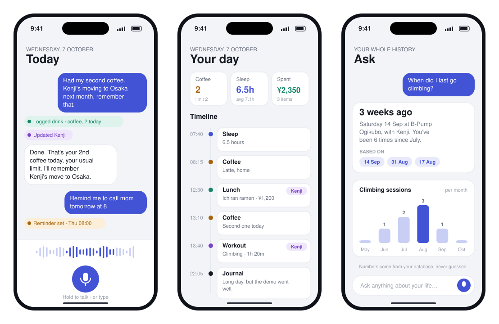
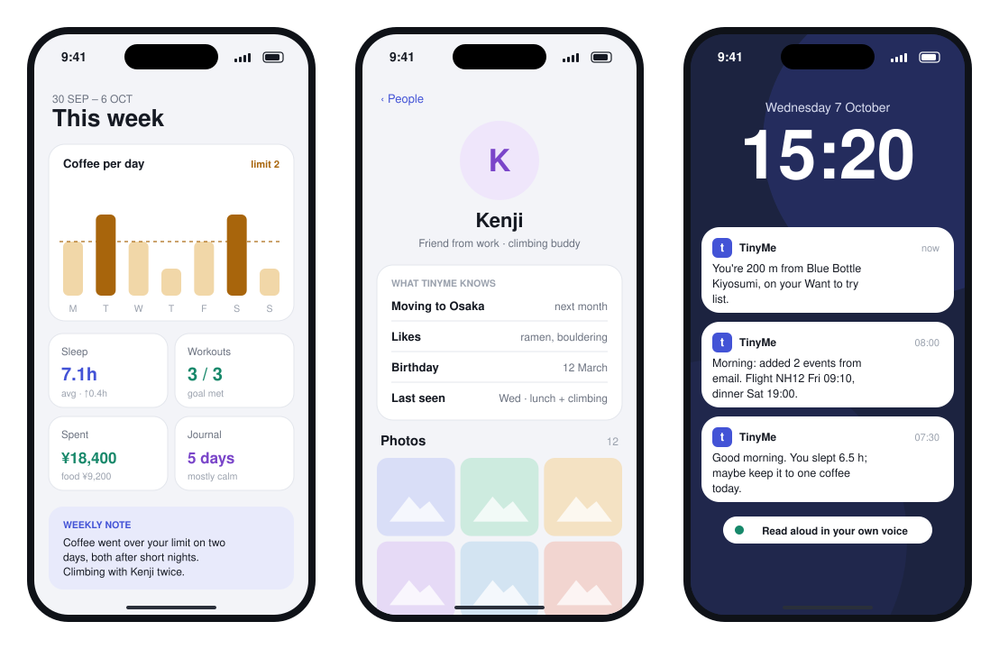
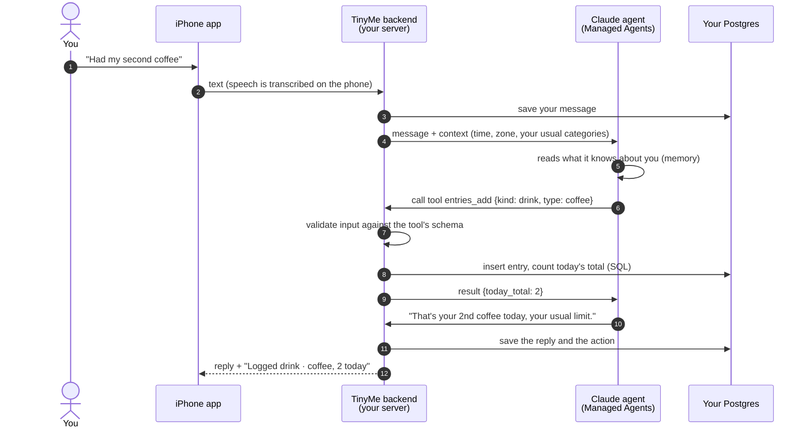
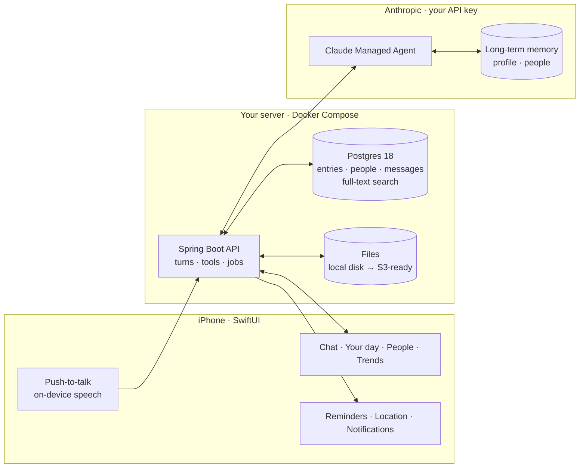

<div align="center">

# TinyMe

**Your life, logged by talking.**
A private, voice-first personal agent for iPhone that you run on your own server.

[](LICENSE)


-161A23.svg)

<br/>



<sub>Concept designs for the iOS app. Logging already works end to end in the backend; the rest is on the roadmap below.</sub>

</div>

---

## The idea

You already produce a stream of small facts about your life: the second coffee, the friend who's moving to Osaka, the ramen place you want to try, ¥1,200 for lunch, a good day or a bad one.

Keeping track of them means a different app for each thing, a form for every entry, and a category for every thought. So almost nobody keeps it up.

**TinyMe works the other way round. You just talk:**

> *"Had my second coffee. Kenji's moving to Osaka next month, remember that. Remind me to call mom tomorrow at 8."*

TinyMe works out that this is **a log, a fact about a person, and a reminder**, and files each one in the right place. You never pick a category or fill in a field. Later you ask your own life questions:

> *"When did I last go climbing?"* · *"How much did I spend on food this month?"* · *"What do I know about Kenji?"*

…and get answers built from **your own records**, with the dates they came from.

---

## What makes it different

| | |
|---|---|
| 🎙️ **Zero forms** | Voice first. A single sentence can hold several things to file, and each one is handled. New kinds of logs ("piano practice", "headache", "plants watered") need no code: the agent invents the category and reuses it consistently. |
| 🔒 **Your data, your server** | Everything lives in **your own Postgres database** on a machine you control. You bring your own API key. Full export and delete-everything are part of the design. |
| 🔢 **Honest numbers** | The model decides *what* to do; code does it. Every count, total and trend comes from a SQL query, never from the model's guess. "No record of that" is a valid answer; "you never did that" is not. |
| 🧠 **Remembers like a friend** | Durable facts about you and the people in your life (preferences, routines, birthdays, life events) are kept in long-term agent memory and used naturally in later conversations. |
| 🛡️ **Safe by default** | Anything with outside effects (sending email, accepting invites, deleting data) needs your tap to confirm. Email content is treated as data, never as instructions. People in photos are only ever known from your own tags; there's no face recognition. |
| 🧩 **Open source, modular** | MIT-licensed. Gmail, Calendar, Places and voice are separate modules you can switch off; the core works without Google at all. |

---

## What it will do



<sub>Concept designs: weekly trends, what TinyMe knows about a person, and proactive notifications.</sub>

| Capability | Example | Status |
|---|---|---|
| **Log anything** | "Had a latte" · "Slept 6.5 hours" · "Journal: long day, but the demo went well" | ✅ Working in the backend |
| **Chat history** | Every message you send and every reply, kept in your database | ✅ Working in the backend |
| **Ask your history** | "When did I last go climbing?" · "How many coffees this week?" | 🛠️ Building now (Phase 1) |
| **People** | "Kenji is my friend from work, he likes ramen" | 🛠️ Building now (Phase 1) |
| **Photos** | "This is Kenji at Kamakura" → find it later by person, place or date | 🛠️ Phase 1 |
| **iPhone app** | Push-to-talk, streamed replies, your day, people, photos | 🗺️ Phase 1b |
| **Email → Calendar** | Flights, bookings and invites found in Gmail land on a "TinyMe" calendar every morning, without duplicates | 🗺️ Phase 2 |
| **Reminders & goals** | "Remind me to call mom at 8" · "Run 3× a week" with progress nudges | 🗺️ Phase 3 |
| **Expenses & trends** | "¥1,200 lunch at Ichiran", receipt photos, weekly and monthly summaries with charts | 🗺️ Phase 4 |
| **Saved places nearby** | "You're 200 m from Blue Bottle Kiyosumi, on your Want to try list" | 🗺️ Phase 5 |
| **Your own voice** | Notifications played in short clips you recorded yourself | 🗺️ Phase 6 |

---

## How it works



**The core rule: the model decides, your code acts.**

- The agent chooses *what* should happen ("this is a drink log").
- Your backend checks the request against a strict schema, runs it, and stores the result.
- Each tool call is recorded with a unique event ID, so a repeated event after a network drop **never logs your coffee twice**.
- Any failure becomes an error the agent can read and explain to you. A broken tool never leaves you without an answer.

---

## Architecture



| Layer | Choice | Why |
|---|---|---|
| Agent | **Claude Managed Agents** | Hosted agent loop with sessions, long-term memory stores and custom tools, so the backend only implements the tools |
| Backend | **Java 25 · Spring Boot 4.1 · Maven** | Typed, testable, and boring in the best way. Virtual threads for long agent turns |
| Database | **Postgres 18** · JSONB · full-text search · trigram · earthdistance · Flyway | One generic `entries` table the agent can fill with any kind of log; numbers come from SQL |
| Storage | Local disk with **S3-ready rules** | Start simple; move to S3, R2 or MinIO-compatible storage without changing the app |
| Client | **SwiftUI**, sideloaded from Xcode | No App Store needed: plug in your iPhone, build, and it's your app |
| Quality | JUnit · Testcontainers (real Postgres) · GitHub Actions | Every repository is tested against a real database |

---

## Where it stands today

TinyMe is in **Phase 1: the core loop**. On the backend, a message goes all the way through the real agent and back:

- ✅ **Agent provisioning on startup.** The agent, environment and memory store are created or updated from versioned YAML in the repo, and are never duplicated. Your memory is never silently replaced.
- ✅ **Tool framework.** Schema validation, run-once guarantees per event, and errors as readable results.
- ✅ **First real tool (`entries_add`).** It logs anything, keeps its own vocabulary of categories consistent, and returns today's total from SQL.
- ✅ **Turn loop.** One session per day, a context block per message, streamed events, tool calls answered live, and a hard timeout with clean cancellation.
- ✅ **Chat history** saved in your own database.
- ✅ **Terminal chat for development.** Send "had a coffee" and watch the rows appear.
- ✅ **141 automated tests** passing, including real Postgres via Testcontainers.

**Next up:** the remaining six tools (count, search, edit, delete, people), then the HTTP API with live streaming to the phone, and then the iPhone app.

### Roadmap

| Phase | Goal | Done when |
|---|---|---|
| **1. Core backend** | Talk → log → recall | Logging, counting, searching and people all work end to end |
| **1b. iPhone app** | The same, by voice, on the phone | Used daily for two weeks without opening the database |
| **2. Google** | Gmail → Calendar every morning | A week of real email creates correct events with no duplicates |
| **3. Actions & goals** | Reminders, confirmations, nudges | "Remind me at 8" works even with the phone offline |
| **4. Money & trends** | Expenses, receipts, weekly and monthly reports | A monthly report matches the card statement to the yen |
| **5. Places** | "You're near a place you saved" | Walking past a saved cafe triggers exactly one alert |
| **6. Voice & trust** | Own-voice notifications, memory editor, export/delete | You can see, edit and wipe everything TinyMe knows |
| **7. v1.0** | A stranger can install it from this README | A friend sets it up with no help |

---

## Privacy, in plain words

- **Your records stay with you.** Entries, people, photos and messages are stored in your Postgres database and your file storage, on your machine.
- **Conversations are processed by Claude** through **your own Anthropic API key**. That's how the agent understands you. Its long-term memory lives in a memory store under your account, and you'll be able to read, edit and delete it.
- **Minimum data to the model.** Tools return only what's needed (matching entries or totals), never whole tables.
- **You're in control of outside effects.** Nothing is sent, accepted or deleted on your behalf without a confirmation tap.
- **Planned:** one-tap export of everything, delete-everything (database, files, memory and agent sessions), and automatic clean-up of old sessions.

---

## Cost to run

TinyMe is self-hosted, so there's no subscription. You pay for what you use:

| Item | Rough cost |
|---|---|
| Claude API (normal daily use) | **≈ $5–15 / month**. Measured in development: about $0.05 for the first message of the day (prompt cache warm-up), then about $0.007 per message |
| Server | Any small VPS, home server or spare machine running Docker |
| Apple | Free Apple ID works (re-install every 7 days); the $99/year developer account removes that limit and adds push notifications |

Per-session and monthly budget caps are part of the plan.

---

## Run it yourself (developers)

> The iPhone app isn't built yet. Today you can run the backend and chat with it from the terminal.

**You need:** JDK 25, Docker, and an [Anthropic API key](https://console.anthropic.com/).

```sh
# 1. Configure
cp .env.example .env              # then set ANTHROPIC_API_KEY
                                  # and TINYME_ALLOW_MISSING_HANDLERS=true while Phase 1 tools are being built

# 2. Start Postgres
docker compose --env-file .env -f deploy/docker-compose.yml -f deploy/docker-compose.dev.yml up -d postgres

# 3. Talk to it
cd server
./mvnw spring-boot:run -Dspring-boot.run.profiles=dev -Dspring-boot.run.arguments="had a coffee"
```

On first start, TinyMe creates its agent, environment and memory store on Anthropic and saves their IDs in your database. Every later start only updates what changed.

More detail: [`server/README.md`](server/README.md) (package layout, tests, setup) · [`deploy/README.md`](deploy/README.md) (Docker).

```text
tinyme/
├── server/   Spring Boot backend: agent, tools, domain, migrations, seeds
├── ios/      SwiftUI app (Phase 1b)
├── deploy/   Docker Compose for the backend and Postgres
└── docs/     Guides and images
```

---

## Get involved

TinyMe started as one engineer's attempt to build the assistant he actually wanted: one that remembers, counts honestly, and belongs to its user. It's built in the open, one tested piece at a time.

Support would speed up the parts that turn a working backend into something people use every day:

- **The iPhone app**, voice-first, fast, and calm to use
- **Design**, so logging your life feels lighter than any form
- **A security and privacy review** before the first public release
- **Beta testers**, and API credits for their first months

If that interests you, open an issue or reach out on GitHub: [@bharatekarhade](https://github.com/bharatekarhade).

---

<div align="center">
<sub>MIT License · Built in Tokyo · TinyMe is an independent project and isn't affiliated with Anthropic or Apple.</sub>
</div>
